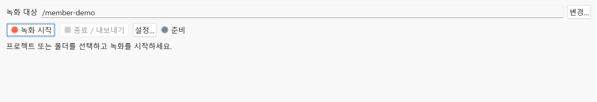
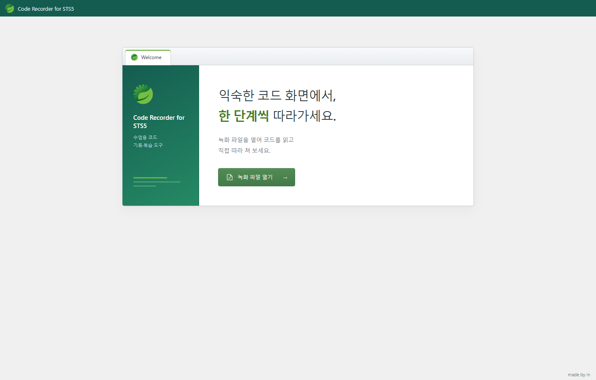
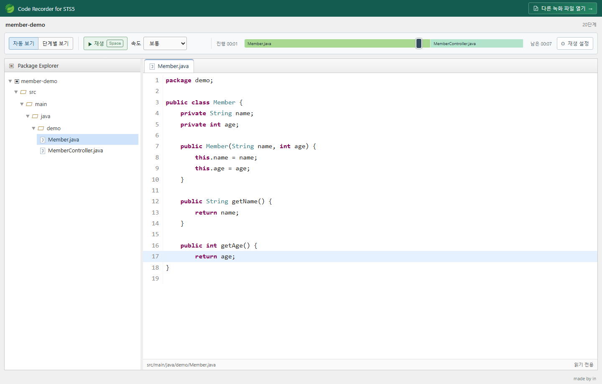
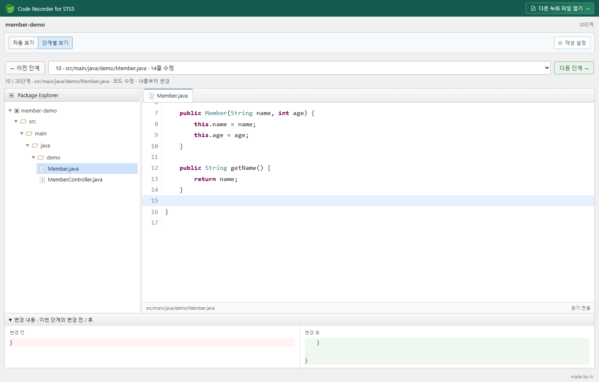
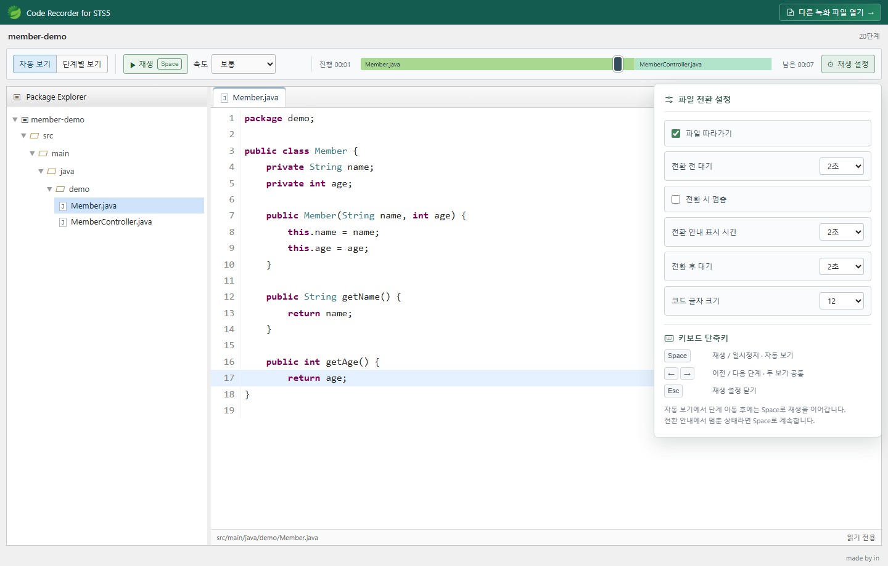

# Code Recorder for STS5

코드 작성 과정과 파일 변경을 기록해 녹화 파일로 저장하는 확장 프로그램입니다.

## 확장 프로그램 화면

녹화 대상과 설정을 확인하고 **녹화 시작**, **종료 / 내보내기**를 사용합니다.

## 사용 환경

확인된 환경은 **Spring Tools 5.2.0.RELEASE / Eclipse 4.40 / Windows**, IDE 실행용 **Java 25**입니다. IDE 실행용 Java와 프로젝트의 JDK 설정은 별개입니다. 확장 버전은 **0.5.2**입니다.

## 설치

### Eclipse Marketplace

[Code Recorder for STS5 등록 페이지](https://marketplace.eclipse.org/content/code-recorder-sts5)

1. STS5에서 **Help → Eclipse Marketplace…**를 엽니다.
2. `Code Recorder for STS5`를 검색합니다.
3. 사용 중인 IDE에 맞는 항목의 **Install**을 누릅니다.
4. 설치 항목과 라이선스를 확인하고 설치한 뒤 IDE를 재시작합니다.
5. **코드 녹화 → 녹화 창 열기**를 선택합니다.

마켓 심사 중에는 검색·설치가 제공되지 않을 수 있습니다. 이 경우 아래 ZIP 설치 방법을 이용하세요.

### ZIP 파일

| 파일 | 용도 |
|---|---|
| `code-recorder-sts5-update-site-0.5.2.zip` | STS5 확장 설치 |

1. **Help → Install New Software… → Add… → Archive…**를 선택합니다.
2. 제공된 확장 설치 ZIP을 선택합니다. 압축은 풀지 않습니다.
3. **Code Recorder**를 선택하고 **Next**로 진행합니다.
4. 설치 내용과 라이선스를 확인합니다. 신뢰 확인이 표시되면 설치하려는 Code Recorder 항목을 확인합니다.
5. 설치가 끝나면 IDE를 재시작합니다.
6. **코드 녹화 → 녹화 창 열기** 또는 **Window → Show View → Other… → Code Recorder**를 엽니다.

업데이트할 때도 새 확장 ZIP을 같은 방식으로 선택합니다.

## 코드 녹화

1. 녹화 창의 **변경…**에서 프로젝트 또는 폴더를 선택합니다.
2. **설정…**에서 제외할 폴더·파일 이름과 기록할 확장자를 지정합니다.
3. **녹화 시작**을 누르고 녹화 대상 폴더 **밖**에 저장 위치를 지정합니다.
4. 파일을 오가며 코드를 작성합니다. 저장하지 않은 편집도 기록됩니다.
5. **종료 / 내보내기**를 누르면 `.coderec.json` 파일이 완성됩니다.

녹화 창을 닫아도 녹화는 계속됩니다. 종료할 때 녹화 창을 다시 여세요.

기본 파일명: `sts5-프로젝트명-yyyyMMdd-HHmmss.coderec.json`

### 기록 범위

시작 코드와 이후 편집, 붙여넣기, 자동 완성, 실행 취소·다시 실행, 파일 전환·생성·이동·삭제를 기록합니다. 숨김 경로, 빌드 산출물, 설정한 제외 이름은 기록하지 않습니다.

파일당 2MB, 초기 텍스트 합계 약 64MB 제한이 있습니다. 큰 프로젝트는 필요한 하위 폴더를 선택하세요. 여러 탭이 있는 편집기는 **소스 탭**에서 사용합니다.

## 플레이어

[STS5 플레이어 열기](https://paper.pe.kr/code-recorder/sts5/)

### 녹화 파일 열기

**녹화 파일 열기**에서 저장한 `.coderec.json` 파일을 선택합니다.

### 자동 보기

**재생** 또는 **Space**로 재생·일시정지합니다. 속도를 선택하거나 타임라인으로 이동할 수 있습니다.

### 단계별 보기

**이전 단계 / 다음 단계** 또는 **← / →**로 이동하고 변경 전·후 코드를 확인합니다.

### 재생 설정

파일 전환 대기 시간, 전환 시 멈춤, 코드 글자 크기를 조절합니다. 단축키도 여기서 확인할 수 있습니다.

## 기록 복구

녹화 중에는 저장 위치에 `.journal.jsonl` 복구 기록도 생성됩니다. 비정상 종료로 최종 파일이 만들어지지 않았다면 복구를 위해 이 파일을 보관하세요.

녹화에는 시작 코드와 삭제한 코드도 포함됩니다. 다른 사람에게 전달하기 전에 내용을 확인하세요.

## 사용 라이선스

MIT 라이선스로 배포됩니다. 저작권 및 라이선스 고지를 유지하면 사용·수정·재배포·상업적 이용이 가능합니다. 자세한 조건은 [LICENSE](LICENSE)를 확인하세요.
